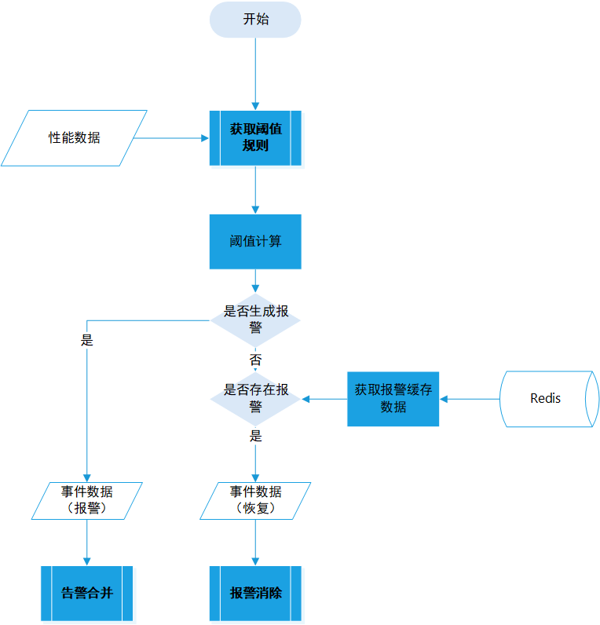

## 阈值规则

### 1、名词解释

- 1、**报警级别：**也叫事件级别，指的是事件影响和扩散的范围。根据严重程度`一级报警>二级报警>三级报警`.

  [1]、一级报警：发送语音, 短信, IM, 邮件

  [2]、二级报警：发送短信, IM, 邮件

  [3]、三级报警：发送IM，邮件
  
- 2、**统计周期**
  判断报警的时候使用最近多长时间以内的数据
  
- 3、**触发条件**

  | 触发条件            | 触发条件类型 | 运算符（operator） | 判断值                      | 说明(样例)                                                   |
  | ------------------- | ------------ | ------------------ | --------------------------- | ------------------------------------------------------------ |
  | 连续发生-all        | all          | `>,>=,=,<,<=`      | `matric_value`              | metric持续 **180** 秒每个值都 **> 2**                        |
  | 发生次数-happen     | happen       | `>,>=,=,<,<=`      | `matric_count,matric_value` | metric持续 **180** 秒内 **2** 次值 **> 2**                   |
  | 数据上报中断-nodata | nodata       |                    |                             | metric持续 **180** 秒无数据上报                              |
  | 最大值-max          | max          | `>,>=,=,<,<=`      | `matric_value`              | metric持续 **180** 秒最大值 **> 2**                          |
  | 最小值-min          | min          | `>,>=,=,<,<=`      | `matric_value`              | metric持续 **180** 秒最小值 **> 2**                          |
  | 均值-avg            | avg          | `>,>=,=,<,<=`      | `matric_value`              | metric持续 **180** 秒均值 **> 2**                            |
  | 求和-sum            | sum          | `>,>=,=,<,<=`      | `matric_value`              | metric持续 **180** 秒求和值 **> 2**                          |
  | 突增突降-diff       | diff         | `>,>=,=,<,<=`      | `matric_value`              | metric最新值与其之前 **180** 秒的任意值之差 (区分正负) **> 2** |
  | 突增突降率-pdiff    | pdiff        | `>,>=,=,<,<=`      | `matric_value`              | metric(最新值与其之前 **180** 秒的任意值之差)除以对应历史值 (区分正负) **> 2** ％ |

* 4、**留观时长**
  告警恢复后持续观察多少秒，称为留观时长，未再触发阈值才发送恢复通知

### 2、阈值规则流程

* [1] 根据性能数据的CI_ID和KPI_CODE从redis中获取相对应的阈值规则
* [2] 通过阈值计算判断是否生成报警事件
* [3]如果生成报警事件,则进行报警合并流程.
* [4] 如果阈值判断为正常,则查询缓存中是否存在已有报警.如果存在已有报警,就生成报警恢复事件,进行报警消除流程.